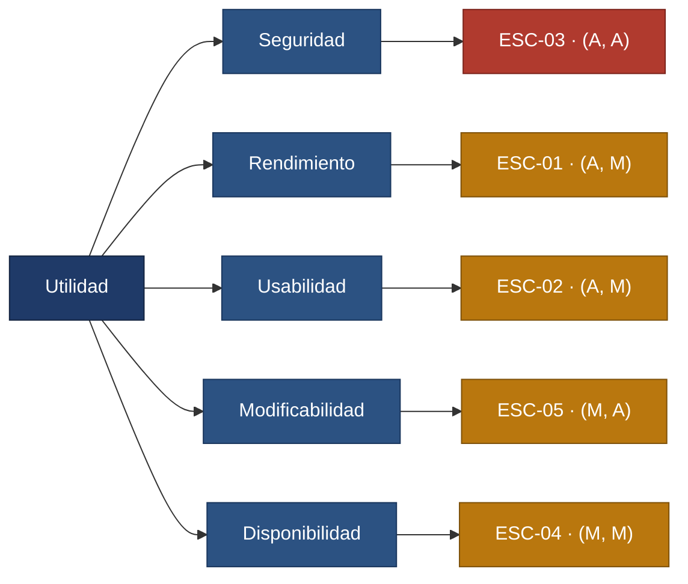

# UniTeam — Documentación de arquitectura (arc42)

> Documento basado en la plantilla **arc42 versión 9.0**, creada y mantenida por
> Dr. Peter Hruschka, Dr. Gernot Starke y colaboradores — <https://arc42.org>.
> La plantilla original en inglés se conserva sin modificar en
> [`arc42-template-EN.md`](arc42-template-EN.md).

| | |
|---|---|
| **Proyecto** | UniTeam — plataforma colaborativa para equipos universitarios |
| **Equipo** | Julio César Emiliani · Ian Novoa Carrillo · Juan José Bustamante · Daniel Isaac Manjarrés |
| **Periodo** | Semestre 2026-20 |
| **Estado** | Secciones 1, 2, 3, 9, 10 y 11 redactadas. Las demás se completan en las semanas siguientes. |

---

# 1. Introducción y objetivos

UniTeam centraliza la gestión de las tareas de un proyecto universitario. Hoy esa información
vive dispersa entre grupos de mensajería, documentos y hojas de cálculo, y esa dispersión hace
difícil saber qué debe hacerse, quién responde por cada cosa, qué prioridad tiene y en qué
estado está. El detalle del problema y del aporte está en la [ficha del proyecto](../ficha.md).

## 1.1 Resumen de requisitos

Requisitos funcionales que definen el alcance del prototipo. Se derivan de los
[aspectos declarados](../aspectos.md) y son **lo que el sistema debe hacer**; no deben
confundirse con las [restricciones](#2-restricciones-de-la-arquitectura) de la sección 2, que
son condiciones impuestas al equipo y que este no eligió.

| ID | Requisito funcional |
|----|--------------------|
| RF-01 | Un integrante puede crear tareas dentro de un proyecto. |
| RF-02 | Un integrante puede asignar una tarea a otro miembro del equipo. |
| RF-03 | Cada tarea tiene una prioridad que puede establecerse y modificarse. |
| RF-04 | Cada tarea tiene un estado dentro de un flujo de trabajo definido. |
| RF-05 | Cada tarea puede tener una fecha límite. |
| RF-06 | Cualquier integrante puede consultar el progreso de las actividades del proyecto. |

## 1.2 Metas de calidad

Las tres metas de calidad que más influyen en la arquitectura, en orden de prioridad. La
priorización completa, con impacto y riesgo, está en el
[árbol de utilidad](../calidad/arbol-utilidad.md).

| Prioridad | Meta de calidad | Motivación | Escenario |
|-----------|----------------|-----------|-----------|
| 1 | **Seguridad** | La información de un equipo no puede quedar expuesta a otro. Es el mayor riesgo del sistema y compromete al equipo frente a la normativa de datos personales. | [ESC-03](../calidad/escenarios-calidad.md#esc-03) |
| 2 | **Rendimiento** | Consultar el estado del proyecto debe ser más rápido que preguntar por el chat del grupo; si no, la herramienta pierde su razón de ser. | [ESC-01](../calidad/escenarios-calidad.md#esc-01) |
| 3 | **Usabilidad** | Un equipo universitario no invierte tiempo en aprender a usar una herramienta para un trabajo de una semana. La adopción es el negocio. | [ESC-02](../calidad/escenarios-calidad.md#esc-02) |

Disponibilidad y modificabilidad son metas secundarias, con escenarios propios
([ESC-04](../calidad/escenarios-calidad.md#esc-04) y
[ESC-05](../calidad/escenarios-calidad.md#esc-05)), pero no dominan las decisiones de diseño.

## 1.3 Interesados

Resumen. El mapa completo, con intereses, conflictos y trazabilidad, está en
[`docs/calidad/interesados.md`](../calidad/interesados.md).

| ID | Rol | Expectativa principal | Atributo derivado |
|----|-----|----------------------|-------------------|
| I-01 | Estudiante integrante | Registrar y consultar tareas sin más esfuerzo que escribirlas en el chat. | Usabilidad, Rendimiento |
| I-02 | Líder de equipo | Ver el estado real del proyecto de un vistazo. | Rendimiento, Disponibilidad |
| I-03 | Profesor | Evidencia confiable del avance, sobre todo en fechas de entrega. | Disponibilidad, Trazabilidad |
| I-04 | Equipo de desarrollo | Cambiar el sistema sin romperlo, con dedicación parcial. | Modificabilidad, Testeabilidad |
| I-05 | Universidad — TI y protección de datos | Cumplimiento normativo y cero fugas entre equipos. | Seguridad, Privacidad |
| I-06 | Estudiante ajeno al proyecto | *(Interesado indirecto)* No debe poder acceder a información de un equipo del que no es miembro. | Seguridad |

---

# 2. Restricciones de la arquitectura

Las restricciones son condiciones **impuestas** al equipo, no decisiones de diseño: limitan el
espacio de soluciones posibles antes de empezar a diseñar. Se distinguen de los requisitos de
la sección 1.1 —lo que el sistema debe hacer— y de las decisiones de arquitectura de la
sección 9 —lo que el equipo elige.

## 2.1 Restricciones técnicas

| ID | Restricción | Justificación | Consecuencia arquitectónica |
|----|------------|--------------|----------------------------|
| T1 | El stack está acotado a **NestJS o FastAPI** en el backend y **Flutter o Next.js** en el frontend. | Son las tecnologías que el equipo conoce o puede aprender dentro del semestre. Ampliar el abanico haría inviable el prototipo con dedicación parcial. | La elección concreta dentro de ese conjunto es una decisión pendiente, documentada en [ADR-001](../adr/ADR-001-seleccion-de-stack.md). El diseño se mantiene independiente del framework hasta que se resuelva. |
| T2 | El sistema se entrega para **navegador web y/o escritorio**. La aplicación móvil nativa queda fuera del alcance. | El equipo decidió no abordar móvil en este semestre; sostener un cliente móvil adicional excede la capacidad disponible. | Condiciona T1: cualquier opción de frontend debe cubrir web o escritorio. Fija además el entorno de los escenarios [ESC-01](../calidad/escenarios-calidad.md#esc-01) y [ESC-02](../calidad/escenarios-calidad.md#esc-02). |
| T3 | El despliegue se hace sobre **infraestructura gratuita o cuentas de estudiante**. | No hay presupuesto (ver O3). | Recursos de cómputo y memoria limitados, y posible latencia de arranque en frío. Es la razón por la que [ESC-01](../calidad/escenarios-calidad.md#esc-01) acota su meta a 200 tareas y 30 usuarios concurrentes, y por la que [ESC-04](../calidad/escenarios-calidad.md#esc-04) no promete alta disponibilidad. |
| T4 | La documentación vive **en el mismo repositorio**, en Markdown, con los diagramas como código (Mermaid). | Requisito del curso y condición para que la documentación evolucione junto con el código en lugar de quedar desactualizada en una herramienta aparte. | No se usan herramientas de diagramación propietarias ni binarios que no puedan revisarse en un *diff*. |

## 2.2 Restricciones organizativas

| ID | Restricción | Justificación | Consecuencia arquitectónica |
|----|------------|--------------|----------------------------|
| O1 | Equipo de **4 estudiantes con dedicación parcial**, durante un semestre. | Composición fija del curso. | El alcance se limita a un prototipo. Eleva el peso de la modificabilidad ([ESC-05](../calidad/escenarios-calidad.md#esc-05)): nadie tiene tiempo de rehacer módulos enteros. |
| O2 | **Entregas incrementales semanales**, calificadas una sola vez, con arc42, C4 y ADR obligatorios. | Metodología del curso. | Obliga a que cada decisión quede registrada cuando se toma, no al final. Favorece decisiones reversibles y entregables pequeños. |
| O3 | **Sin presupuesto**: solo herramientas gratuitas o de código abierto. | Proyecto académico sin financiación. | Descarta servicios administrados de pago y es el origen de T3. |
| O4 | El uso de IA generativa está permitido pero es de **registro obligatorio** en [`docs/ia.md`](../ia.md), y las decisiones de arquitectura las toma el equipo. | Política del curso y decisión propia del equipo, para que la autoría del trabajo quede clara. | Toda propuesta generada con IA se revisa y se aprueba explícitamente antes de incorporarse. |

## 2.3 Restricciones legales

| ID | Restricción | Justificación | Consecuencia arquitectónica |
|----|------------|--------------|----------------------------|
| L1 | Cumplimiento de la **Ley 1581 de 2012** y el Decreto 1377 de 2013 (protección de datos personales, Colombia). | El sistema almacena datos personales de estudiantes: nombre, correo institucional y actividad dentro de los proyectos. | Exige consentimiento informado, finalidad declarada, derecho de supresión de la cuenta y control estricto de acceso. Es una de las fuentes de [ESC-03](../calidad/escenarios-calidad.md#esc-03), incluido su registro de auditoría. |
| L2 | Las dependencias deben tener **licencias compatibles con el uso académico**, preferiblemente permisivas (MIT, Apache-2.0, BSD). | Evitar obligaciones de licenciamiento que el equipo no puede asumir ni evaluar. | Se evita el copyleft fuerte en librerías que se enlacen con el producto. |
| L3 | El trabajo debe ser **original y con autoría atribuible**; las fuentes y el uso de IA se citan. | Normativa académica de integridad. | Se refleja en el registro de [`docs/ia.md`](../ia.md) y en la atribución de la plantilla arc42 al inicio de este documento. |

---

# 3. Contexto y alcance

## 3.1 Contexto de negocio

El diagrama de contexto (C4 nivel 1) está en
[`docs/c4/nivel1-contexto.md`](../c4/nivel1-contexto.md), junto con la leyenda y el detalle de
lo que queda fuera del alcance.

| Socio de comunicación | Entradas hacia UniTeam | Salidas desde UniTeam |
|----------------------|------------------------|----------------------|
| Estudiante integrante | Creación y actualización de tareas propias, cambios de estado. | Lista de tareas asignadas, prioridades, fechas límite. |
| Líder de equipo | Creación del proyecto, invitaciones, asignación de tareas. | Tablero con el avance del proyecto y la carga por integrante. |
| Profesor | Solicitud de consulta del avance de un equipo. | Vista de solo lectura del progreso del proyecto. |
| Proveedor de identidad *(externo, previsto)* | Confirmación de identidad del usuario. | Solicitud de autenticación. |
| Servicio de correo electrónico *(externo, previsto)* | — | Invitaciones a un proyecto y avisos de fecha límite. |

**Fuera del alcance:** aplicación móvil nativa, integración con plataformas institucionales de
aprendizaje o de calificaciones, mensajería entre integrantes y registro de tiempo trabajado.

## 3.2 Contexto técnico

Los canales técnicos son **previstos**: quedan condicionados por la restricción T1 y se
confirmarán en [ADR-001](../adr/ADR-001-seleccion-de-stack.md).

| Canal | Participantes | Protocolo previsto | Qué transporta |
|-------|--------------|--------------------|----------------|
| C1 | Cliente (navegador o escritorio) ↔ UniTeam | HTTPS sobre una API web | Operaciones sobre proyectos y tareas, y las vistas de consulta. |
| C2 | UniTeam ↔ Proveedor de identidad | OAuth 2.0 / OpenID Connect sobre HTTPS | Delegación de la autenticación y obtención de la identidad del usuario. |
| C3 | UniTeam ↔ Servicio de correo | API del proveedor o SMTP autenticado | Invitaciones y avisos salientes. |
| C4 | UniTeam ↔ Almacenamiento persistente | Conexión de base de datos cifrada en tránsito | Persistencia de proyectos, tareas, membresías y registro de auditoría. |

**Correspondencia entre entradas/salidas y canales:** toda interacción de usuario (sección
3.1) viaja por **C1**; la autenticación nunca viaja por C1 con credenciales propias, sino que
se delega por **C2**; las salidas asíncronas hacia el usuario van por **C3**; y el registro de
auditoría exigido por [ESC-03](../calidad/escenarios-calidad.md#esc-03) se escribe por **C4**.

---

# 4. Estrategia de solución

*Pendiente.* Se redacta cuando se resuelva ADR-001 y se defina la descomposición inicial.

# 5. Vista de bloques de construcción

*Pendiente.* Corresponde a los niveles 2 y 3 de C4.

# 6. Vista de tiempo de ejecución

*Pendiente.*

# 7. Vista de despliegue

*Pendiente.*

# 8. Conceptos transversales

*Pendiente.* Se prevé documentar aquí el modelo de autorización que soporta
[ESC-03](../calidad/escenarios-calidad.md#esc-03).

# 9. Decisiones de arquitectura

Las decisiones se registran como ADR en [`docs/adr/`](../adr/).

| ADR | Decisión | Estado |
|-----|----------|--------|
| [ADR-001](../adr/ADR-001-seleccion-de-stack.md) | Selección del stack dentro del conjunto permitido por T1. | Propuesta — pendiente de decisión del equipo |

---

# 10. Requisitos de calidad

## 10.1 Árbol de calidad

El árbol de utilidad completo, con la priorización por impacto en el negocio y riesgo
técnico y las renuncias explícitas del equipo, está en
[`docs/calidad/arbol-utilidad.md`](../calidad/arbol-utilidad.md).

## 10.2 Escenarios de calidad

Cinco escenarios en formato de seis partes, con su medida de respuesta. El detalle completo
—fuente, estímulo, artefacto, entorno, respuesta, medida y método de verificación— está en
[`docs/calidad/escenarios-calidad.md`](../calidad/escenarios-calidad.md).

| ID | Atributo | Resumen del escenario | Medida de respuesta | Prioridad |
|----|----------|----------------------|--------------------|-----------|
| [ESC-01](../calidad/escenarios-calidad.md#esc-01) | Rendimiento | El líder consulta el tablero de un proyecto con 200 tareas y 30 usuarios concurrentes. | p95 ≤ 2 s y p99 ≤ 4 s; 0 errores en 100 solicitudes. | (A, M) |
| [ESC-02](../calidad/escenarios-calidad.md#esc-02) | Usabilidad | Un estudiante sin capacitación crea su primer proyecto y asigna 3 tareas. | ≤ 5 min; 8 de cada 10 participantes lo logran; 0 errores irrecuperables. | (A, M) |
| [ESC-03](../calidad/escenarios-calidad.md#esc-03) | Seguridad | Un usuario autenticado pide por la API una tarea de un proyecto del que no es miembro. | 100 % denegado con HTTP 403; 0 campos expuestos; auditoría en ≤ 1 s. | (A, A) |
| [ESC-04](../calidad/escenarios-calidad.md#esc-04) | Disponibilidad | El backend cae de forma abrupta durante la semana de entregas. | Restablecimiento ≤ 2 min; 0 escrituras confirmadas perdidas; ≥ 99 % mensual. | (M, M) |
| [ESC-05](../calidad/escenarios-calidad.md#esc-05) | Modificabilidad | Un desarrollador agrega el estado «En revisión» al flujo de trabajo. | ≤ 2 componentes; ≤ 1 día-persona; API pública sin cambios incompatibles. | (M, A) |

---

# 11. Riesgos y deuda técnica

Riesgos identificados hasta la fecha. La lista crece a medida que avanza el diseño.

| ID | Riesgo o deuda | Origen | Mitigación |
|----|---------------|--------|-----------|
| R-01 | El stack aún no está decidido; empezar a construir sin resolverlo generaría retrabajo. | T1 | Resolver ADR-001 antes de la primera implementación. Mantener el diseño independiente del framework hasta entonces. |
| R-02 | La infraestructura gratuita puede impedir cumplir la latencia de ESC-01 por arranque en frío. | T3 | Medir temprano con la prueba de carga de ESC-01; si no se cumple, renegociar la meta o el entorno de despliegue, dejando constancia. |
| R-03 | El control de acceso atraviesa todos los endpoints; un error de diseño se propaga a todo el sistema. | ESC-03 | Pruebas automatizadas de acceso en integración continua, con un caso negativo por endpoint. |
| R-04 | Deuda técnica aceptada de forma consciente por la presión de las entregas semanales. | O1, O2 | Registrarla en esta sección cuando se contraiga, en lugar de sobre-diseñar por anticipado. |

# 12. Glosario

| Término | Definición |
|---------|-----------|
| Aspecto declarado | Capacidad que el equipo se compromete a evidenciar en el prototipo. Ver [`docs/aspectos.md`](../aspectos.md). |
| Escenario de calidad | Descripción de seis partes —fuente, estímulo, artefacto, entorno, respuesta y medida— que convierte un atributo de calidad en algo verificable. |
| Árbol de utilidad | Herramienta que refina la utilidad del sistema en atributos, refinamientos y escenarios, priorizados por impacto en el negocio y riesgo técnico. |
| Proyecto | Espacio de trabajo de un equipo dentro de UniTeam. Es la unidad de control de acceso. |
| Tarea | Unidad de trabajo con responsable, prioridad, estado y fecha límite, perteneciente a un proyecto. |
| ADR | *Architecture Decision Record*: registro de una decisión de arquitectura, su contexto y sus consecuencias. |
