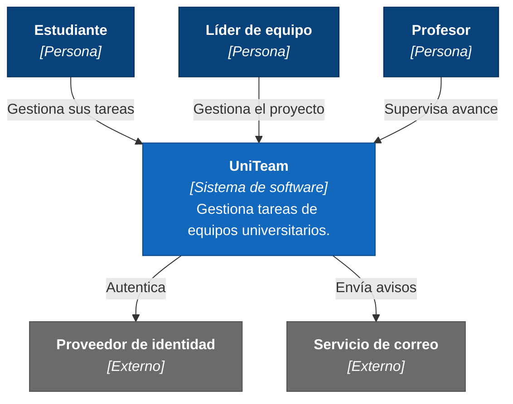

# C4 — Nivel 1: Diagrama de contexto del sistema

Muestra a UniTeam como una caja negra, quién lo usa y con qué sistemas externos se relaciona.
El nivel 1 responde a *qué hace el sistema y para quién*, no a *cómo está construido*: por eso
**no aparece ninguna tecnología** en el diagrama. La elección del stack se documentará en
[0001-acotar-el-stack-a-cuatro-opciones.md) y afectará a partir del nivel 2 (contenedores).

## Diagrama

## Leyenda

| Color | Significado |
|-------|-------------|
| Azul oscuro | Persona: usuario del sistema. |
| Azul | Sistema en construcción, alcance de este proyecto. |
| Gris | Sistema externo, fuera del control del equipo. |

## Actores

| Actor | Descripción | Interesado |
|-------|-------------|-----------|
| Estudiante integrante | Miembro de un equipo de trabajo universitario. Usa UniTeam para saber qué le corresponde y reportar su avance. | [I-01](../calidad/interesados.md) |
| Líder de equipo | Estudiante que coordina el proyecto. No es un rol administrativo distinto, sino un integrante con permisos de gestión del proyecto. | [I-02](../calidad/interesados.md) |
| Profesor | Consulta el avance de los equipos. Su acceso es de solo lectura. | [I-03](../calidad/interesados.md) |

## Sistemas externos

Ambos están marcados como **previstos**: son parte del alcance planeado, pero todavía no se
ha seleccionado el proveedor concreto ni se ha implementado la integración.

| Sistema | Para qué se usa | Por qué es externo |
|---------|----------------|--------------------|
| Proveedor de identidad | Autenticación de los usuarios mediante cuenta institucional o de Google. | Construir un manejo propio de contraseñas aumentaría el riesgo de ESC-03 y el trabajo de cumplimiento de la restricción L1, sin aportar valor al problema que UniTeam resuelve. |
| Servicio de correo electrónico | Invitaciones a un proyecto y avisos de fechas límite. | Entregar correo de forma confiable es un problema resuelto por terceros y ajeno al dominio del proyecto. |

## Fuera del alcance

Lo siguiente **no** forma parte del sistema y por lo tanto no aparece en el diagrama:

- Aplicación móvil nativa. El prototipo se entrega para **navegador web y/o escritorio**
  (restricción T2).
- Integración con plataformas institucionales de aprendizaje o con el sistema de
  calificaciones de la universidad.
- Mensajería o chat entre integrantes: UniTeam organiza tareas, no reemplaza el canal de
  comunicación del equipo.
- Registro de tiempo trabajado y facturación.
