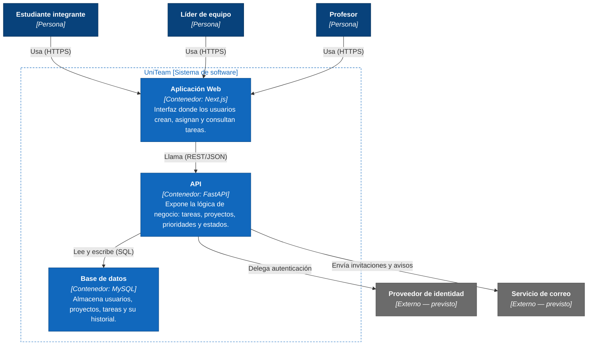

# C4 - Nivel 2: Diagrama de contenedores 

Abre la caja de UniTeam del nivel 1 y muestra sus contenedores: las unidades independientes  que lo componen
(aplicación web, API y base de datos), cómo se comunican entre si y con los sistemas externos ya identificados.
El nivel 2 responde a *como esta construido el sistema a alto nivel*, por eso aparece la tecnología concreta - 
la seleccionada en
[ADR-001](../adr/001-seleccion-de-stack.md).

## Diagrama

## Leyenda

| Color | Significado |
|-------|-------------|
| Azul oscuro | Persona: usuario del sistema. |
| Azul | Contenedor: unidad de despliegue dentro del alcance de este proyecto. |
| Gris | Sistema externo, fuera del control del equipo. |

## Contenedores

| Contenedor | Tecnología | Responsabilidad |
|------------|-----------|------------------|
| Aplicación Web | Next.js | Interfaz donde los usuarios crean, asignan y consultan tareas. Único punto de entrada para los tres actores. |
| API | FastAPI | Expone la lógica de negocio: tareas, proyectos, prioridades y estados. Única puerta de acceso a la base de datos y a los sistemas externos. |
| Base de datos | MySQL | Almacena usuarios, proyectos, tareas y su historial. |

## Relaciones

| Origen | Destino | Descripción | Protocolo |
|--------|---------|-------------|-----------|
| Estudiante, Líder de equipo, Profesor | Aplicación Web | Uso de la interfaz | HTTPS |
| Aplicación Web | API | Consumo de la lógica de negocio | REST/JSON |
| API | Base de datos | Persistencia de datos | SQL |
| API | Proveedor de identidad | Delegación de autenticación | — (previsto) |
| API | Servicio de correo | Envío de invitaciones y avisos | — (previsto) |

## Sistemas externos

Se mantienen los mismos identificados en el [nivel 1 — contexto](./nivel1-contexto.md), ambos
marcados como **previstos**.

| Sistema | Para qué se usa |
|---------|----------------|
| Proveedor de identidad | Autenticación de los usuarios mediante cuenta institucional o de Google. |
| Servicio de correo electrónico | Invitaciones a un proyecto y avisos de fechas límite. |

## Fuera del alcance

- División de la API en microservicios: en el prototipo se mantiene como un único contenedor
  monolítico (ver [ADR-001](../adr/ADR-001-seleccion-de-stack.md)).
- Caché o cola de mensajería independiente: no hay un contenedor dedicado a esto en esta
  entrega; `events/` vive dentro del contenedor API (ver nivel 3 — componentes).
- Balanceo de carga o réplicas de base de datos: no aplican a un prototipo académico.
