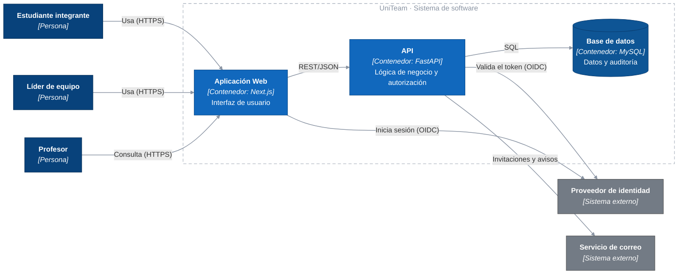

# C4 — Nivel 2: Diagrama de contenedores

Descompone UniTeam en las unidades desplegables que lo forman. A diferencia del
[nivel 1](nivel1-contexto.md), este nivel sí lleva tecnología: la fijan
[0002 — Usar FastAPI y Next.js](../adr/0002-usar-fastapi-y-nextjs.md) y
[0004 — Usar MySQL](../adr/0004-usar-mysql-como-base-de-datos.md).

## Diagrama

## Leyenda

| Color | Significado |
|-------|-------------|
| Azul oscuro | Persona que usa el sistema. |
| Azul | Contenedor: unidad desplegable dentro del alcance del proyecto. |
| Gris | Sistema externo, fuera del control del equipo. |

## Relaciones

| Origen | Destino | Descripción | Protocolo |
|--------|---------|-------------|-----------|
| Estudiante, Líder de equipo, Profesor | Aplicación Web | Uso de la interfaz | HTTPS |
| Aplicación Web | Proveedor de identidad | Inicio de sesión del usuario | OIDC *(previsto)* |
| Aplicación Web | API | Consumo de la lógica de negocio | REST/JSON |
| API | Proveedor de identidad | Validación del token recibido | OIDC *(previsto)* |
| API | Base de datos | Persistencia y registro de auditoría | SQL |
| API | Servicio de correo | Invitaciones y avisos de fecha límite | *(previsto)* |

## Correspondencia con el nivel 1

Las tres personas y los dos sistemas externos del [nivel 1](nivel1-contexto.md) reaparecen aquí
sin cambios; lo que el nivel 1 dibujaba como una caja única —UniTeam— se abre en tres
contenedores. No hay ningún elemento en este diagrama que no exista en el de contexto.

## Correspondencia con el código

Cada contenedor tiene su lugar en el repositorio. Es lo primero que se contrasta en el corte:

| Contenedor | Tecnología | Dónde vive en el repositorio |
|-----------|-----------|------------------------------|
| Aplicación Web | Next.js | **Todavía sin código.** Prevista para la semana 6; hoy la API se ejercita con su documentación interactiva en `/docs` y con las pruebas. |
| API | FastAPI | `app/main.py`, `app/api/`, `app/application/`, `app/domain/`, `app/events/` |
| Base de datos | MySQL | `app/infrastructure/` — esquema en `tablas.py`, acceso en `repositorios.py` |

## Nota sobre los eventos de dominio

[0003](../adr/0003-usar-eventos-de-dominio-en-proceso.md) elige un estilo orientado a eventos.
Ese estilo **no aparece como contenedor** porque se aplica **en proceso**: el despacho ocurre
dentro de la API (`app/application/bus.py`), sin broker ni cola externa. Añadir un componente de
mensajería restaría margen a [ESC-04](../calidad/escenarios-calidad.md#esc-04) e implicaría
infraestructura que la restricción T3 no contempla. Productores y consumidores son estructura
interna de la API y corresponden al nivel 3.

## Nota sobre el flujo de autenticación

El navegador se redirige al proveedor de identidad (OIDC) y la API se limita a validar el token
recibido: las credenciales **nunca pasan por UniTeam**, lo que reduce el alcance de la
restricción legal L1 y la superficie de riesgo de
[ESC-03](../calidad/escenarios-calidad.md#esc-03).

**Estado actual:** la integración OIDC todavía no está implementada. Mientras tanto la API toma
la identidad de la cabecera `X-Usuario` (`app/api/dependencias.py`), que es un sustituto
provisional y explícitamente inseguro. Lo que sí es real es la **autorización**: la pertenencia
al proyecto se comprueba contra la base de datos en cada operación.
