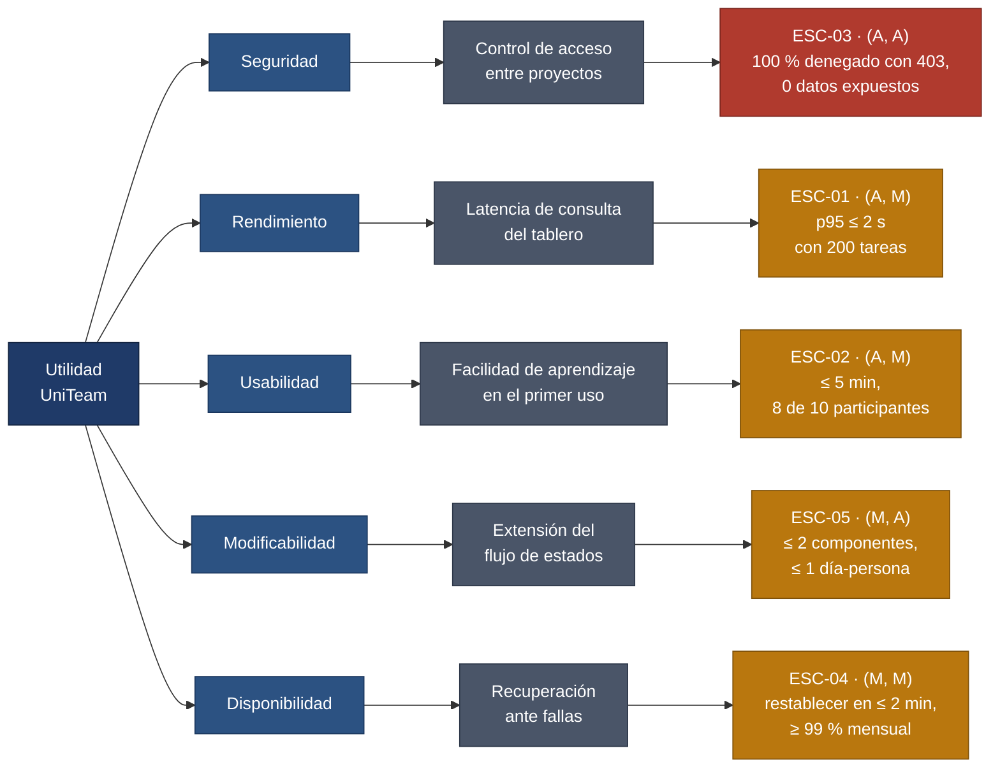

# Árbol de utilidad — UniTeam

El árbol de utilidad ordena los atributos de calidad por **impacto en el negocio** y **riesgo
técnico**, y es la brújula de las decisiones de arquitectura del proyecto. Refina la utilidad
general del sistema en atributos, cada atributo en un refinamiento concreto, y cada
refinamiento en un [escenario medible](escenarios-calidad.md).

**Cómo se lee la etiqueta `(X, Y)`:** el primer valor es el impacto en el negocio y el
segundo el riesgo técnico, en escala **A**lto / **M**edio / **B**ajo. Un escenario `(A, A)`
es a la vez lo más valioso y lo más difícil: ahí es donde la arquitectura tiene que trabajar.

## El árbol

## Priorización

Ordenados de mayor a menor prioridad arquitectónica:

| Orden | Escenario | Atributo | Impacto en el negocio | Riesgo técnico | Justificación de la prioridad |
|-------|-----------|----------|----------------------|----------------|-------------------------------|
| 1 | [ESC-03](escenarios-calidad.md#esc-03) | Seguridad | **Alto** | **Alto** | Una fuga de información entre equipos destruye la confianza en la herramienta y expone al equipo frente a la Ley 1581 de 2012. Además el control de acceso atraviesa todos los endpoints: equivocarse aquí obliga a rehacer el sistema entero, no un módulo. |
| 2 | [ESC-01](escenarios-calidad.md#esc-01) | Rendimiento | **Alto** | Medio | Si el tablero es más lento que preguntar por el chat, el equipo abandona la herramienta. El riesgo es medio porque las soluciones son conocidas —paginación e índices—, pero la infraestructura gratuita (T3) las vuelve menos holgadas de lo habitual. |
| 3 | [ESC-02](escenarios-calidad.md#esc-02) | Usabilidad | **Alto** | Medio | La adopción es el negocio. Va después de ESC-01 porque el rendimiento es una precondición de la usabilidad: una interfaz lenta es una interfaz inusable, por bien diseñada que esté. |
| 4 | [ESC-05](escenarios-calidad.md#esc-05) | Modificabilidad | Medio | **Alto** | El impacto para el usuario final es indirecto, pero el riesgo es alto: si el flujo de estados queda rígido, un equipo de dedicación parcial no logra evolucionar el prototipo durante el semestre. |
| 5 | [ESC-04](escenarios-calidad.md#esc-04) | Disponibilidad | Medio | Medio | Es crítico solo en la ventana de entregas. El resto del tiempo una caída breve es tolerable, y las plataformas de despliegue ya ofrecen reinicio automático, lo que reduce el trabajo propio. |

## Qué estamos dispuestos a sacrificar

La priorización obliga a renunciar a algo. Estas son las renuncias explícitas del equipo:

- **Se sacrifica disponibilidad a cambio de seguridad y de costo.** No se busca alta
  disponibilidad con redundancia: el 99 % mensual de ESC-04 acepta hasta 7 h 12 min de caída
  al mes. Montar redundancia consumiría el presupuesto de esfuerzo del semestre y el
  presupuesto económico es cero (restricción O3).
- **Se sacrifica granularidad de permisos a cambio de usabilidad.** El control de acceso es
  por proyecto y no por tarea. Se acepta que un miembro del proyecto vea todas las tareas del
  proyecto; lo que no se acepta es que alguien ajeno vea alguna.
- **Se sacrifica rendimiento con volúmenes grandes a cambio de una meta realista.** ESC-01 se
  compromete solo hasta 200 tareas y 30 usuarios concurrentes. Fuera de ese rango el sistema
  no promete nada, y decirlo es más honesto que prometer «que sea rápido».
- **Se sacrifica generalidad a cambio de modificabilidad donde importa.** No se construye un
  motor de flujos de trabajo configurable; se busca únicamente que agregar un estado cueste
  poco (ESC-05).
