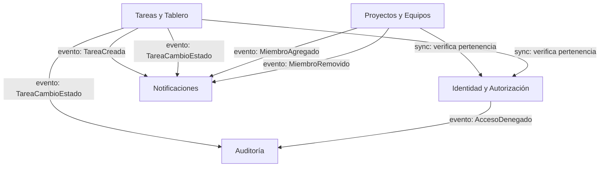

# Mapa de contextos

Contextos delimitados identificados a partir del lenguaje ubicuo usado en los
[interesados](../calidad/interesados.md) y los
[escenarios de calidad](../calidad/escenarios-calidad.md). La forma de comunicación entre
contextos sigue la decisión de [ADR-003](../adr/0003-usar-eventos-de-dominio-en-proceso.md):
Arquitectura Orientada a Eventos con eventos de dominio in-process, salvo autorización, que
es síncrona y obligatoria antes de cualquier operación protegida.

---

## Lenguaje ubicuo por contexto

| Término | Contexto dueño | Significado |
| --- | --- | --- |
| Usuario, rol, permiso | Identidad y Autorización | Cuenta autenticada y su nivel de acceso a un proyecto |
| Proyecto, miembro, invitación | Proyectos y Equipos | Espacio de trabajo de un equipo y quién pertenece a él |
| Tarea, tablero, estado, prioridad | Tareas y Tablero | Unidad de trabajo y su ciclo de vida |
| Evento de auditoría, intento de acceso | Auditoría | Registro inmutable de acciones relevantes para seguridad |
| Notificación, recordatorio | Notificaciones | Aviso derivado de un evento de otro contexto |

*(Ajustar/ampliar según el vocabulario real que use el equipo en el foro y las historias de usuario — esta es una primera pasada, no el resultado final del ejercicio de aula.)*

---

## Diagrama de contextos

Flechas rotuladas `sync:` = relación síncrona (customer/supplier con contrato de consulta).
Flechas rotuladas `evento:` = relación asíncrona vía evento de dominio (published language).
Cada evento va en su propia flecha (en vez de agrupar dos eventos en una etiqueta) para que
Mermaid tenga espacio de sobra y no encime texto.

---

## Relaciones entre contextos

| Contexto origen | Contexto destino | Tipo de relación | Mecanismo | Justificación |
| --- | --- | --- | --- | --- |
| Proyectos y Equipos | Identidad y Autorización | Customer/Supplier | Llamada síncrona (verificación de membresía) | ESC-03: la autorización debe validarse *antes* de cualquier operación, no puede llegar por evento con retraso |
| Tareas y Tablero | Identidad y Autorización | Customer/Supplier | Llamada síncrona | Igual que arriba — ESC-03 |
| Tareas y Tablero | Notificaciones | Published Language | Evento de dominio (`TareaCreada`, `TareaCambioEstado`) | ADR-003: permite agregar consumidores nuevos sin tocar el productor (ESC-05) |
| Tareas y Tablero | Auditoría | Published Language | Evento de dominio | ESC-03: trazabilidad sin acoplar Tareas a la lógica de auditoría |
| Proyectos y Equipos | Notificaciones | Published Language | Evento de dominio (`MiembroAgregado`) | Mismo principio de desacoplamiento del ADR-003 |
| Identidad y Autorización | Auditoría | Published Language | Evento de dominio (`AccesoDenegado`) | ESC-03: "registra el intento fallido" — requisito explícito del escenario |

No se identifica ningún **shared kernel** entre contextos: el ADR-003 descartó explícitamente
mantener comunicación dentro del mismo proceso vía llamadas directas compartiendo modelos,
a favor de eventos. Tampoco se identifica **anticorruption layer** porque el sistema no
integra todavía ningún subsistema externo con su propio modelo de dominio; si en el futuro
se integra con un sistema de la universidad (autenticación institucional, por ejemplo), ahí
sí correspondería una ACL en el contexto de Identidad.

---

## Casos difíciles de delimitar (para discutir en el foro)

- **¿Los "roles dentro de un proyecto" pertenecen a Identidad o a Proyectos y Equipos?**
  El rol *global* de la cuenta (estudiante, profesor) es de Identidad; el rol *dentro de un
  proyecto* (líder, integrante) parece pertenecer a Proyectos y Equipos, no a Identidad.
- **¿La vista de tablero (ESC-01) es un contexto propio o una proyección de lectura de
  Tareas?** Si la latencia se resuelve con una vista materializada, esa vista sigue siendo
  propiedad de Tareas y Tablero (es un detalle de implementación, no un contexto nuevo).
